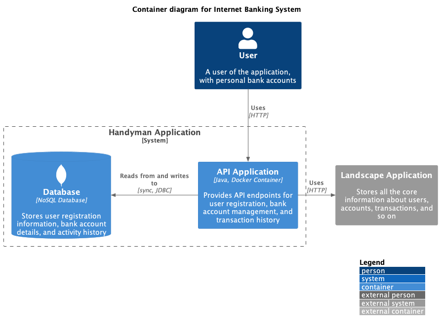
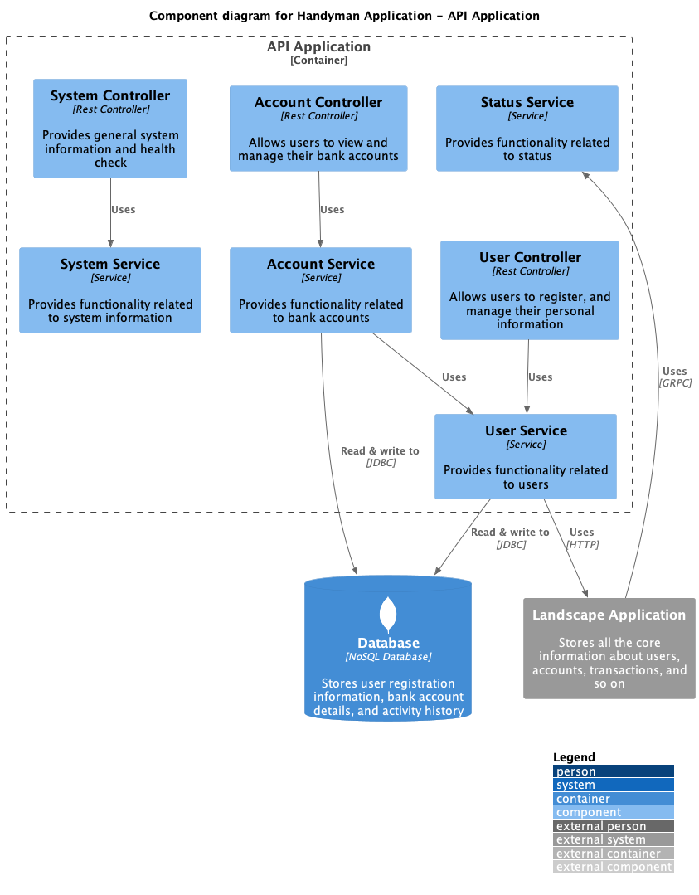

## Handyman

### Description
Handyman is an API that allows users to create and manage their own accounts, and create and manage their bank accounts.
It also allows users to find jobs and apply for them.

### Container diagram

### Component diagram (API)
