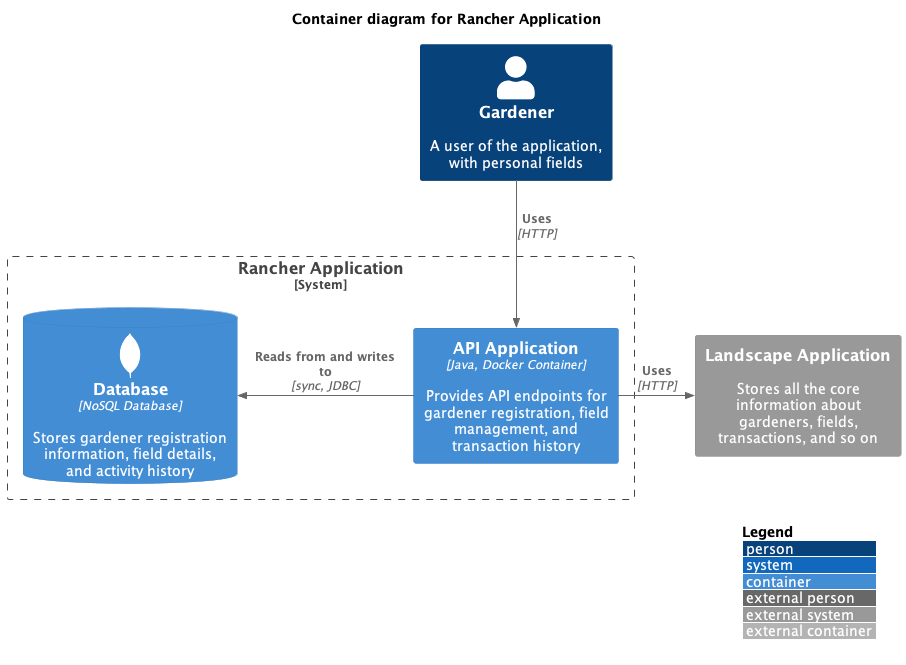
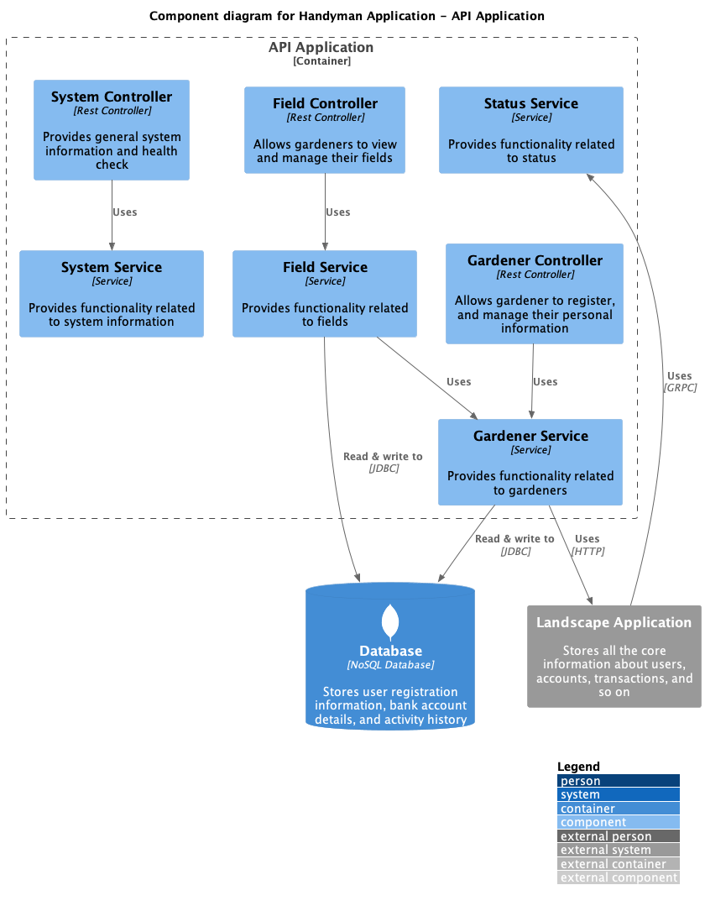

## Rancher

### Description
Rancher is an API that allows gardeners to create and manage their own accounts, and create and manage their fields.
It also allows gardeners to place orders for jobs to be done on their fields.

### Container diagram

### Component diagram (API)
